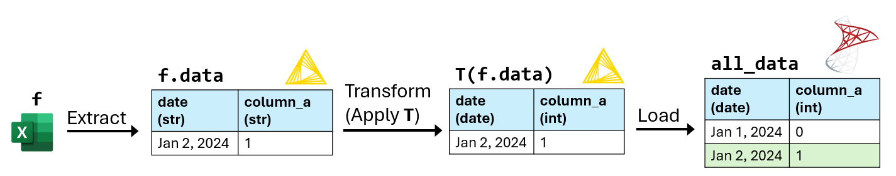

# Extract, Transform, Load (ETL) using KNIME and SQL Server

## Summary

{width="1000"}

!!! abstract ""
    :fontawesome-solid-triangle-exclamation: **Problem:** The analytics team spent a lot of time cleaning the sales and inventory data that they received in Excel files every day. 

    :material-lightbulb-on-10: **Solution:** I used KNIME to develop an ETL program to extract the data from the Excel files, transform the data, then load the transformed data into SQL Server.

    :octicons-graph-16: **Results:** The analytics team can simply query data from SQL Server instead of wrangling data from thousands of Excel files. 
    

## KNIME
KNIME is a low-code data processing app where you can chain “nodes” to create programs. A node is like a function in a programming language. 

{width="600"}
/// caption
Screenshot of KNIME.
///

## Definitions
{width="1000"}

`f`
:   An Excel file containing sales and inventory data for one day. 

`f.data`
:   The data table extracted from `f`. All columns in `f.data` are the string data type. 

`T`
:   A sequence of data transformations. These include:  

    - Transforming column contents using regular expressions.  
    - Converting column data types.  

`T(f.data)`
:   The resulting table after applying `T` to `f.data`. 

`all_data`
:   A database table that stores `T(f.data)` for every Excel file `f`.

**match**
:   A table `A` matches a table `B` if `A` and `B` have the same column names and data types.
    `T(f.data)` can only be loaded into `all_data` if `T(f.data)` matches `all_data`.

`L_all`
:   A list of all the Excel file names.

`L_loaded`
:   A list of the Excel file names `f.name` such that `T(f.data)` has been loaded into `all_data`. 

## Pseudocode of the ETL program

<pre>
<b>Algorithm</b> ETL_program(L):  
    <b>Input:</b>   
        <b>L:</b> A list of Excel file names.
    <b>Output:</b> Nothing. 

	<b>for</b> each Excel file name f.name in L:
	    f.data = Extract the data table from f.  
	    T(f.data) = Apply each transformation in T to f.data. 
        <b>try:</b>
	        Compare the column names and data types in T(f.data) and 
            all_data. If T(f.data) doesn’t match all_data, raise an 
            exception describing the mismatching columns.
	    <b>except</b> Exception as error:
	        Print f"{f}: {error}" (a formatted string).   
	    <b>else:</b>
            <b>if</b> f.name is not in L_loaded: 
	            Load T(f.data) into all_data.
	            Append f.name to L_loaded.   
</pre>
 
`(L_all − L_loaded)` is the list of the Excel file names `f.name` such that `T(f.data)` hasn't been 
loaded into `all_data`. 

After executing `ETL_program(L_all - L_loaded)`, I execute the following steps manually:
<pre>
<b>while</b> (L_all - L_loaded) is not empty:
    f.name = (L_all - L_loaded)[0].
        Execute ETL_program([f.name]). 
        Use the printed error message to update the data 
        transformations in T.
    Execute ETL_program(L_all - L_loaded). 
</pre>

## Example execution of the ETL program

`T`:
:   1. Convert `date` to the date data type.    
    2. Convert `column_a` to the integer data type.   

**1. Execute `ETL_program([f_1.name])`:**  

{width="800"}
/// caption
`T(f_1.data)` can't be loaded into `all_data` because `"missing"` in `column_a` can't be converted to an integer. 
///

**2. Update `T`:**  

`T`: 
:   1. Convert `date` to the date data type.    
    2. In `column_a`, replace all cells matching the regular expression `“^missing$”` with `null`.
    3. Convert `column_a` to the integer data type.

**3. Execute `ETL_program([f_1.name])`:**    

{width="1000"}
/// caption
After updating `T`, `T(f_1.data)` is loaded into `all_data`.
///
