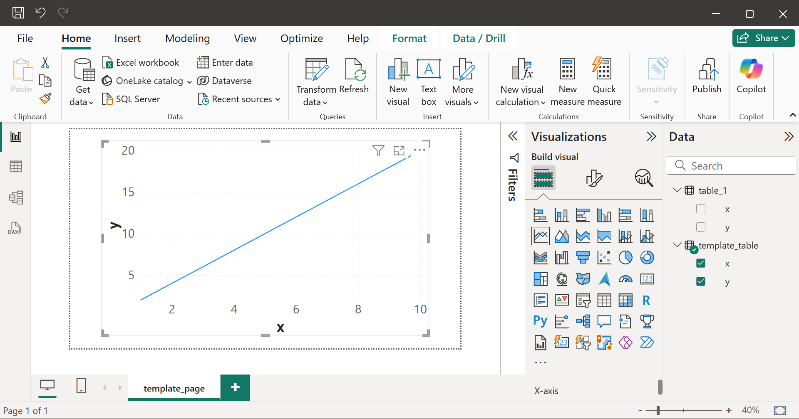
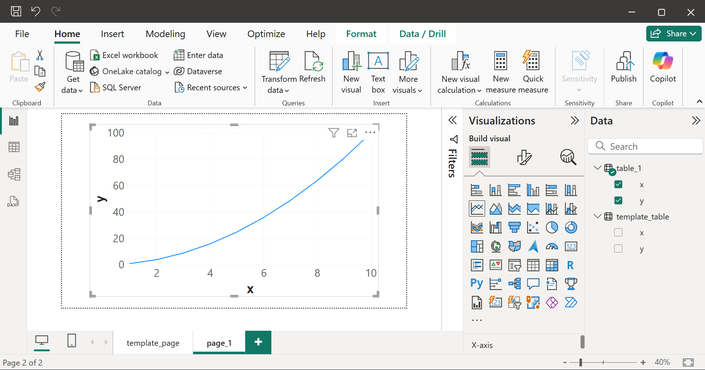

# Creating Power BI report pages using Python

## Summary

{width="500"}

!!! abstract ""
    :fontawesome-solid-triangle-exclamation: **Problem:** The analytics team needed to create hundreds of Power BI report pages, each presenting the data of a different database query. 

    :material-lightbulb-on-10: **Solution:** I wrote a Python script to automate the creation of the Power BI report pages by editing the files in a Power BI Project folder. 

    :octicons-graph-16: **Results:** The Python script saved days of work for my team. Without the script, we would have had to manually create the report pages using the Power BI graphical user interface (GUI). 


## Power BI Projects (PBIP)
A Power BI Project (PBIP) defines a Power BI report using a folder of plain text files. By using PBIPs, we can edit Power BI reports using a programming language, such as Python.     

```py title="project/"
 📂.SemanticModel
 📜.pbip
 📂.Report
```

### `.SemanticModel` folder
Defines the data tables that are used to create the data visualizations in the report pages. 

```py title="project/.SemanticModel/"
 📂tables # (1)!
 ┣ 📜table_1.tmdl
 ┗ 📜template_table.tmdl
```

1. Each `.tmdl` file in the `tables` folder defines a semantic model table. 

### `.pbip` file
A Power BI report such that changes made to the `.Report` and `.SemanticModel` folders will change the `.pbip` file. Furthermore, changes made to the `.pbip` file using the Power BI GUI will change the `.Report` and `.SemanticModel` folders. 

I used the Power BI GUI to create a `template_table` report page, which presents the data from the `template_table` semantic model table. The `template_table` report page defines the appearance of the report pages that the Python script will create.  

{width="900"}
/// caption
`project.pbip`
///

### `.Report` folder  
Defines all the report pages in the Power BI report.  

```py title="project/.Report/"
 📂definition
 ┣ 📂pages # (1)!
 ┃ ┣ 📂template_table
 ┃ ┃ ┣ 📂visuals
 ┃ ┃ ┃ ┗ 📂line_graph
 ┃ ┃ ┃ ┃ ┗ 📜visual.json # (2)!
 ┃ ┃ ┗ 📜page.json
```

1. Each folder in the `pages` folder defines a report page. 
2. Each `visual.json` file defines a data visualization. For example, the file specifies the type of data visualization, and which semantic model tables to use to create the visualization. 


## Python code  

I used the following Python packages: 

- :material-folder-outline: `pathlib` to represent filesystem paths. 
- :material-content-copy: `shutil` to copy files and folders.
- :material-code-json: `json` to edit `.json` files. 
- :material-shape-outline: `typing` to add type hints.    
<br>

**1.** Create variables. 

``` py title="add_pages_to_report.py"
project_path = Path(r"") # paste the path to the Power BI project folder 
pages_path = project_path / ".Report" / "definition" / "pages"

new_table_name = "table_1"
new_page_name = new_table_name
```
<br>
**2.** Create a copy of the `template_table` folder named `table_1`. 

``` py title="add_pages_to_report.py"
def copy_template_page(new_page_name: str) -> None:
    template_page_path = pages_path / "template_table"
    new_page_path = pages_path / new_page_name
    shutil.copytree(template_page_path, new_page_path)


copy_template_page(new_page_name)
```

=== "before"
    ``` py title="project/.Report/definition/pages/"
    📂template_table
    ```

=== "after"
    ``` py title="project/.Report/definition/pages/" 
    📂table_1
    📂template_table
    ```
<br>
**3.** Edit `page.json` to change the name of the new report page from `template_table` to `table_1`.  

``` py title="add_pages_to_report.py"
def edit_page_json(new_page_name: str) -> None:
    page_json = pages_path / new_page_name / "page.json"
    with open(page_json, 'r') as f:
        page_json_data = json.load(f)

    page_json_data['name'] = new_page_name
    page_json_data['displayName'] = new_page_name

    with open(page_json, 'w') as f:
        json.dump(page_json_data, f, indent=4)


edit_page_json(new_page_name)
```  

=== "before"
    ``` json title="project/.Report/definition/pages/table_1/page.json"
    "name": "template_table",
    "displayName": "template_table",
    ```

=== "after"
    ``` json title="project/.Report/definition/pages/table_1/page.json"
    "name": "table_1",
    "displayName": "table_1",
    ```
<br>
**4.** 	Edit `visual.json` to change the semantic model table displayed in the line graph from `template_table` to `table_1`. I use a recursive function to assign `i.value = "table_1"` for all nested items `i` in `visual.json` such that  `i.key == "Entity"`.

``` py title="add_pages_to_report.py"
def update_dict(dictionary, search_key: Hashable, new_value: Any) -> None:
    for key, value in dictionary.items():
        if key == search_key:
            dictionary[key] = new_value
        elif isinstance(value, dict):
            update_dict(value, search_key, new_value)
        elif isinstance(value, list):
            for element in value:
                if isinstance(element, dict):
                    update_dict(element, search_key, new_value)


def edit_visual_json(new_page_name: str, new_table_name: str) -> None:
    visual_json = pages_path / new_page_name / "visuals" / "line_graph" / "visual.json"
    with open(visual_json, 'r') as f:
        visual_json_data = json.load(f)

    update_dict(visual_json_data, "Entity", new_table_name)

    with open(visual_json, 'w') as f:
        json.dump(visual_json_data, f, indent=4)


edit_visual_json("new_page_name", "new_table_name")
```

=== "before"
    ``` json title="project/.Report/definition/pages/table_1/visuals/line_graph/visual.json"
    "Entity": "template_table",
    ```

=== "after"
    ``` json title="project/.Report/definition/pages/table_1/visuals/line_graph/visual.json"
    "Entity": "table_1",
    ```   

## New report pages

=== "before"
    {width="900"}
    /// caption
    `project.pbip`
    ///

=== "after"
    {width="900"}
    /// caption
    `project.pbip`
    ///
